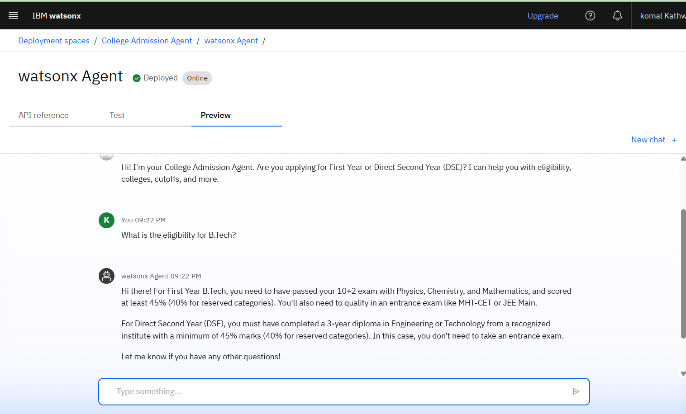

# 🎓 College Admission Agent (RAG-based AI on IBM Cloud)

This is an AI-powered virtual assistant built using **IBM Watsonx**, **Granite LLM**, and **Retrieval-Augmented Generation (RAG)** to streamline the college admission process. It allows prospective students to ask natural language questions and receive accurate, up-to-date answers about eligibility, courses, fees, DSE admissions, and more.

---

## 🚀 Features

- 💬 Chatbot that answers student admission queries
- 🧠 Uses Granite LLM + LangChain + IBM Vector Index (RAG)
- 🎯 Supports First Year & Direct Second Year (DSE) admissions
- 🌐 Deployable with Watsonx Assistant or Web UI
- ✅ Uses IBM Cloud Lite (free tier)

---

## 🧠 Tech Stack

- IBM Watsonx Assistant (Actions Interface)
- IBM Granite LLM (`granite-3-3-8b-instruct`)
- IBM Vector Database + Prompt Templates
- Retrieval-Augmented Generation (RAG)
- LangChain + Python (backend)
- GitHub Pages / Streamlit (optional frontend)

---

## 📂 Folder Structure

college-admission-agent/
├── backend_service/
│ └── granite_agent.py
├── watson_assistant/
│ └── watsonx_agent_export.json
├── screenshots/
│ └── agent_preview.png
│ └── college admission agent.png
├── deployment_details.md
├── LICENSE
├── README.md

---

## 🖼️ Screenshot

---

## 📁 Key Files

| File                         | Purpose                                           |
|------------------------------|---------------------------------------------------|
| `watsonx_agent_export.json`  | Exported Watson Assistant Agent                  |
| `granite_agent.py`           | Python + LangChain logic for Granite LLM         |
| `deployment_details.md`      | IBM Cloud deployment IDs and configuration       |

---

📜 License
This project is licensed under the MIT License.

🙋‍♀️ Author & Internship
Komal Kathwade
B.Tech Student – Computer Engineering, G.H. Raisoni College of Engineering and Management, Pune
Year: Third Year

🧑‍💻 This project was developed as part of the
Edunet Foundation – AICTE Virtual Internship Program
powered by IBM SkillsBuild 